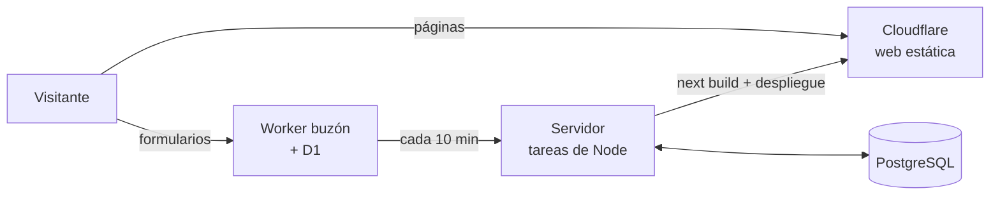

# VetEspaña

Directorio de clínicas veterinarias de España: búsqueda por ciudad, especialidad y
urgencias 24 h, con ficha propia para cada clínica (horario, contacto, fotos y reseñas).

**En producción:** https://www.vetespana.es — más de 2.600 clínicas.

## Tecnologías

| Parte | Tecnología |
|---|---|
| Web | Next.js 16 (App Router) · React 19 · TypeScript · Tailwind CSS 4 |
| Alojamiento | Cloudflare Workers (web estática: solo archivos) |
| Formularios | Worker de Cloudflare en TypeScript + base D1 (SQLite) + captcha Turnstile |
| Base de datos | PostgreSQL (se lee con `pg` al generar la web) |
| Publicación | Tareas de Node.js en un servidor propio (Docker + cron) |

## Cómo funciona

La web es **estática**: no hay servidor de aplicación atendiendo visitas. Cada 10 minutos,
si algo ha cambiado, un servidor lee PostgreSQL, genera todas las páginas en HTML
(`next build` con `output: 'export'`), comprueba que el resultado cuadra y lo sube a
Cloudflare. Si la comprobación falla, no se publica y sigue en línea la versión anterior.

Los formularios (reseñas, altas de clínicas y cambios que piden sus dueños) los recibe un
Worker aparte, el **buzón**, que los valida y los guarda en D1. El servidor los recoge y
los deja en PostgreSQL **pendientes de revisar**: nada sale en la web sin aprobarse antes.



## Estructura del repositorio

```
├── src/
│   ├── app/                 Páginas y rutas (Next.js obliga a este nombre)
│   │   ├── clinicas/            listado con filtros y ficha de cada clínica
│   │   ├── veterinarios/        una página por ciudad (y sus urgencias 24 h)
│   │   ├── comunidades/         una página por comunidad autónoma
│   │   ├── guias/               artículos para dueños de mascotas
│   │   ├── cerca-de-mi/         clínicas más cercanas por geolocalización
│   │   ├── alta-clinica/        formulario para dar de alta una clínica
│   │   └── datos/               índice de clínicas en JSON y datos abiertos (ODbL)
│   ├── componentes/
│   │   ├── busqueda/            buscador, filtros, selector de ciudad, mapa de España
│   │   ├── clinicas/            tarjeta, listado, horario de hoy, clínicas cercanas
│   │   ├── formularios/         alta, reseñas, cambios de los dueños, captcha
│   │   └── estructura/          cabecera, pie, menú móvil, aviso de cookies
│   ├── utilidades/          Lógica compartida: base de datos, búsqueda, SEO, horarios…
│   ├── datos/               Contenido fijo: guías, mapa, lista de ciudades
│   └── tipos/               Tipos de TypeScript (clínica, ciudades, especialidades)
├── cloudflare/
│   ├── web.ts               Worker de la web: redirige las URLs antiguas (301)
│   └── buzon/               Worker de los formularios y el esquema de su base D1
├── tareas/                  Lo que ejecuta el servidor al publicar
│   ├── recoger-buzon.mjs        formularios de D1 → PostgreSQL (pendientes)
│   ├── publicar-altas.mjs       altas aprobadas → clínicas
│   ├── aplicar-ediciones.mjs    cambios aprobados → clínicas
│   ├── geocodificar.mjs         coordenadas a partir de la dirección (OpenStreetMap)
│   ├── miniaturas.mjs           versiones ligeras de las fotos
│   ├── ciudades-bd.mjs          lista de ciudades de la base, antes de generar
│   ├── limpiar-salida.mjs       quita de la web generada lo que no se usa
│   └── comprobar-salida.mjs     revisa la web generada; si no cuadra, no se publica
└── public/                  Imágenes y cabeceras de seguridad (CSP, HSTS…)
```

## Algunos detalles

- **SEO:** una URL limpia por ciudad y comunidad, datos estructurados (JSON-LD
  `VeterinaryCare` con horario), sitemap, y título y descripción propios en cada ficha.
- **Rendimiento:** HTML ya generado servido desde la red de Cloudflare; la búsqueda y
  «Cerca de mí» funcionan en el navegador sobre un índice JSON.
- **Seguridad:** Content-Security-Policy estricta, captcha y límite de envíos por IP en
  los formularios, y rol de solo lectura en la base de datos para generar la web.
- **Privacidad:** la analítica solo se carga si el visitante acepta las cookies.
- **Datos abiertos:** parte de las fichas procede de OpenStreetMap y se publica de vuelta
  con licencia ODbL.

## Desarrollo

```bash
npm install
npm run comprobar   # tipos (tsc) y estilo (eslint)
npm run dev         # necesita DATABASE_URL apuntando a la base PostgreSQL
```

Las claves y direcciones de la base no están en el repositorio: viven en el `.env` del
servidor.
